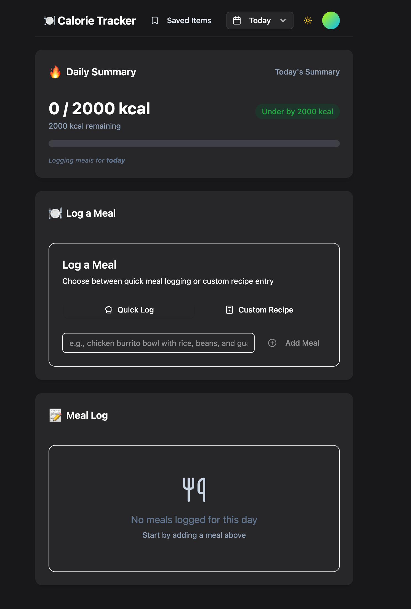

# 🧠 Calorie Tracker

An AI-powered calorie tracking web app that helps users log meals in natural language and track their daily intake effortlessly. Built with React, Tailwind CSS, and Supabase — featuring OpenAI integration for calorie estimation.

---

## ✨ Features

- 📝 **Natural Language Input** – Log meals like “2 eggs and a banana” using plain text.
- 🤖 **AI Calorie Estimation** – Uses OpenAI (GPT-3.5) to estimate calories for meals.
- 👤 **User Authentication** – Secure login/signup powered by Supabase.
- 📊 **Calorie Dashboard** – Visual summary of your daily intake with a reset at midnight.
- ⚙️ **User Settings** – Set calorie goals and connect your own OpenAI API key.
- 🎨 **Modern UI** – Responsive, dark-mode ready interface built with Tailwind CSS and Shadcn/UI.

---

## 🛠 Tech Stack

| Layer       | Technology             |
|-------------|------------------------|
| Frontend    | React, Tailwind CSS, Shadcn/UI |
| Backend     | Supabase (Auth + DB)   |
| AI Engine   | OpenAI GPT-3.5         |
| Hosting     | (Insert if deployed)   |

---

## 🚶‍♂️ User Flow

1. **Sign up / Log in** using Supabase Auth.
2. **Input meals** in plain English.
3. **AI calculates calories** and logs them to your account.
4. **Daily view** of total calorie intake.
5. **Set preferences**: daily goal, theme (coming soon), and your OpenAI API key.

---

## ⚙️ Getting Started

### 1. Clone the repository

```bash
git clone https://github.com/yourusername/calorie-tracker.git
cd calorie-tracker
```

### 2. Install dependencies

```bash
npm install
```

### 3. Setup environment variables

Create a `.env.local` file:

```bash
NEXT_PUBLIC_SUPABASE_URL=your_supabase_url
NEXT_PUBLIC_SUPABASE_ANON_KEY=your_supabase_anon_key
NEXT_PUBLIC_OPENAI_API_KEY=your_openai_key  # or leave blank for user input
```

### 4. Run the development server

```bash
npm run dev
```

---

## 🚧 Known Issues & To-Do

- 🛠️ AI calorie estimation needs improved prompt tuning.
- 🎨 Minor UI bugs (theme toggle, layout fixes).
- 🧹 Redundant code cleanup.
- 💬 Enhance NLP for better food parsing.

---

## 📦 Future Enhancements

- 📷 Barcode scanning for packaged foods.
- 🧮 Macronutrient tracking (protein, carbs, fats).
- 📈 Historical data and progress charts.
- 📲 Mobile app version.

---

## 🧑‍💻 Contributing

Pull requests are welcome! For major changes, please open an issue first.


---

## 📸 Screenshots



---

## 💬 Questions?

Feel free to open an issue or reach out if you’d like to collaborate!
